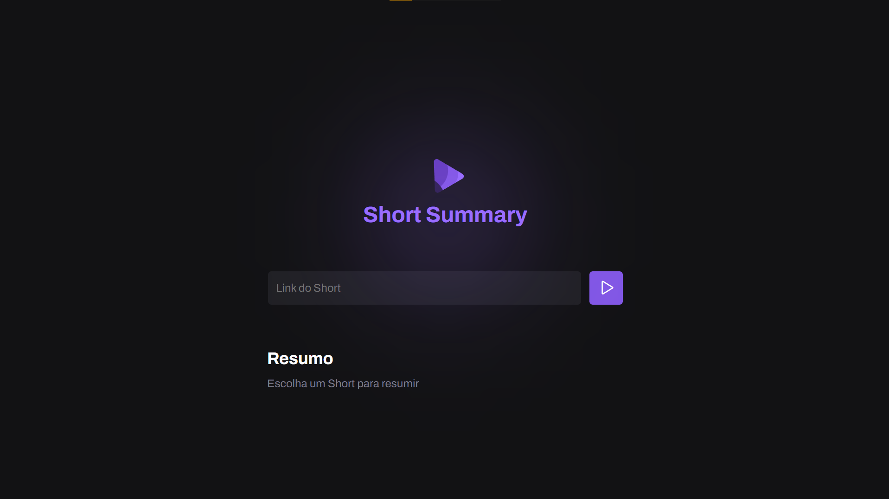

# Short Summary

#### Projeto desenvolvido durante o evento NLW IA da Rocketseat, meu projeto com Express. Coloque o URL de um vídeo Shorts e magicamente (uma inteligencia artificial) você irá obter o resumo do vídeo! 

### 🔗 Links

### 💻📱 Screenshots

### 🛠 Funcionalidades

- Resumir vídeos curtos.

### 👾 Tecnologias

### ✅ Melhorias
- Design moderno.

### 🎓 Aprendizados
- NodeJS:
- Introdução ao NodeJS.

- ExpressJS:
- Introdução ao EspressJS

### 📚 Referência

### 📱 Contato

danielsrbueno@gmail.com
